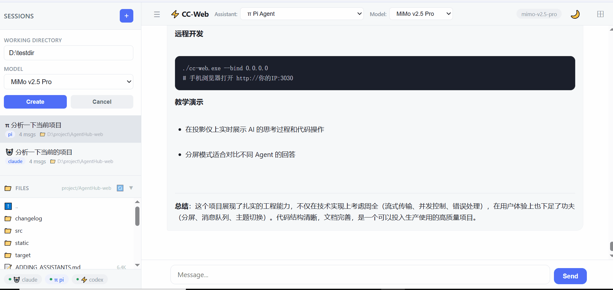

# CC-Web

> **🌐 [English](./README_EN.md)** | 中文

> 🚀 **[去下载!!!](https://github.com/soso192/AgentHub-web/releases)** 赶快给我用起来!!! 👉 **[https://github.com/soso192/AgentHub-web/releases](https://github.com/soso192/AgentHub-web/releases)**

> 统一的 AI 编程助手 Web 平台 — 一个界面管理所有 AI Agent

**CC-Web** 是一个高性能的 Web 平台，让你在浏览器中统一管理和使用多种 AI 编程助手（Claude Code、Pi Agent、Codex 等）。支持实时流式输出、多会话分屏并行、Agent 无缝切换、消息队列、暗色主题等企业级特性。




---
去下载!!!  https://github.com/soso192/AgentHub-web/releases
赶快给我用起来!!!  https://github.com/soso192/AgentHub-web/releases
## ✨ 核心特性

### 🤖 多 Agent 统一管理
- **Claude Code** — Anthropic 的 CLI 编程助手
- **Pi Agent** — Pi Coding Agent
- **OpenAI Codex** — OpenAI 的编程助手
- 同一平台自由切换，无需多个终端窗口

### 🖥️ 分屏并行模式
- **网格布局** — 支持 1×1、2×1、1×2、2×2、3×2、3×3 六种布局
- **独立会话** — 每个面板运行独立的 AI 会话，互不干扰
- **同步模式** — 一条消息同时发送到所有面板，多 Agent 并行回答同一问题
- **面板位置记忆** — 支持在任意网格位置添加面板，空位自动保留
- **实时状态** — 每个面板独立显示流式传输状态（LIVE 指示灯）
- **点击联动** — 点击面板自动同步侧边栏选中状态、顶栏助手信息、文件浏览器路径

### 🔀 Agent 无缝切换
- 在同一会话中切换不同 Agent，**对话上下文自动保留**
- 切换时自动构建历史摘要，新 Agent 无缝继续对话
- 每条消息标记生成它的 Agent，切换后历史消息标签不变
- 面板模式下同样支持切换，流式内容正确渲染到面板中

### 🔄 实时流式输出
- **思考过程**（Thinking）— 可折叠展示 AI 的推理过程
- **工具调用**（Tool Calls）— 实时显示 Bash 命令、文件读写、代码编辑等操作
- **工具结果**（Tool Results）— 即时展示命令执行输出
- **文本流**（Text Stream）— 逐字输出 AI 回复
- **流式事件持久化** — 刷新页面不丢失正在流式传输的内容

### ⏹ 中止 & 消息队列
- **Stop 按钮** — 随时中止正在运行的 Agent
- **消息队列** — Agent 工作时继续输入，消息自动排队
- **智能路由** — 队列消息自动路由到正确的面板或主视图
- **队列 UI** — 队列状态显示在输入框上方，支持逐条删除和清空
- **防竞态** — 中止操作立即清理流式状态，防止残留事件渲染到下一条消息

### 💾 会话持久化
- 所有会话自动保存到 `~/.cc-web/sessions.json`
- **重启后会话不丢失**，包括完整的聊天记录和 content blocks
- Claude Agent 支持 `--resume` 原生会话恢复
- Pi Agent 支持 `--session` 原生会话恢复

### 📁 内置文件浏览器
- 侧边栏文件树，实时浏览工作目录
- 点击文件弹出代码预览（深色主题）
- 支持目录导航、文件图标、大小显示
- **可拖拽调整高度** — 拖拽文件浏览器顶部边框调整大小，高度自动保存
- **会话联动** — 切换会话时自动更新文件浏览器目录

### 🌙 暗色主题
- 完整的 Dark/Light 双主题支持
- 一键切换（🌙/☀️ 按钮），自动保存偏好
- 自动检测系统主题偏好（`prefers-color-scheme`）
- 所有组件统一使用 CSS 变量，主题切换无闪烁

### 📝 结构化日志系统
- 日志写入文件 `~/.cc-web/logs/cc-web-YYYY-MM-DD.log`
- 五级日志：`error` > `warn` > `info` > `debug` > `trace`
- 控制台只显示启动横幅，详细日志只写文件
- 环境变量控制级别：`RUST_LOG=debug`、`RUST_LOG=cc_web::ai::pi=trace`
- 自动清理 7 天前的日志文件
- 调试 API：`GET /api/debug/state` 返回所有会话的实时状态快照

### 🎨 现代化 UI
- 深色代码块、Markdown 渲染、表格支持
- 可折叠的思考/工具调用块
- 统一的 CSS 变量设计系统（圆角、阴影、颜色语义化）
- 所有交互元素带平滑过渡动画
- 响应式布局，移动端友好

---

## 💡 实际使用场景

### 场景 1：多 Agent 对比 — 同一个问题问三个 AI
分屏模式下，同一个问题同时发给 Claude、Pi、Codex，分屏实时对比回答：

```
┌──────────────┬──────────────┬──────────────┐
│  🤖 Claude   │  ⚡ Pi Agent │  🔧 Codex    │
│              │              │              │
│ "用索引优化"  │ "建议分区表"  │ "用CTE重构"  │
│              │              │              │
│ [实时输出中...]│ [已完成]      │ [实时输出中...]│
└──────────────┴──────────────┴──────────────┘
```

### 场景 2：远程开发 — 用手机/平板写代码
在你的工作站上运行 `cc-web.exe`，然后用任何设备的浏览器访问：

```bash
# 工作站上启动
./cc-web.exe --bind 0.0.0.0

# 手机浏览器打开 http://你的IP:3030
```

### 场景 3：长任务监控 — 让 AI 跑任务，实时看进度
让 Claude 执行一个复杂的重构任务，你可以：
- 实时看到它在读哪些文件、执行什么命令
- 随时点 **Stop** 中止（发现方向错了就停）
- 中途继续输入新指令（消息自动排队）

### 场景 4：教学演示 — 展示 AI 编程过程
在投影仪上打开 CC-Web，实时展示 AI 的思考过程和代码操作。

---

## 🏗️ 技术架构

```
┌─────────────────────────────────────────────────────────┐
│                    Browser (Vanilla JS)                   │
│  ┌──────────┐  ┌──────────┐  ┌──────────┐  ┌──────────┐ │
│  │ SSE Client│  │  Chat UI │  │FileBrowser│  │  Queue   │ │
│  │  (3层超时) │  │(分屏+单屏)│  │(可拖拽)   │  │(智能路由) │ │
│  └────┬─────┘  └────┬─────┘  └────┬─────┘  └────┬─────┘ │
└───────┼──────────────┼──────────────┼──────────────┼──────┘
        │              │              │              │
┌───────┼──────────────┼──────────────┼──────────────┼──────┐
│       ▼    Rust (Actix-Web)         ▼              ▼      │
│  ┌──────────┐  ┌──────────┐  ┌──────────┐  ┌──────────┐ │
│  │ SSE      │  │  Agent   │  │  Files   │  │ Session  │ │
│  │ Broadcast│  │  Router  │  │  API     │  │ Persist  │ │
│  │(1024容量) │  │          │  │          │  │          │ │
│  └────┬─────┘  └────┬─────┘  └──────────┘  └──────────┘ │
└───────┼──────────────┼────────────────────────────────────┘
        │              │
        ▼              ▼
┌───────────────────────────────┐
│     AiAssistant Trait          │
│  ┌────────┐ ┌──────┐ ┌──────┐│
│  │ Claude │ │  Pi  │ │Codex ││
│  └───┬────┘ └──┬───┘ └──┬───┘│
└──────┼─────────┼────────┼─────┘
       ▼         ▼        ▼
   CLI Process  CLI Process  CLI Process
  (stream-json) (JSON)       (JSON)
```

**后端**：Rust + Actix-Web，单文件 ~3MB，零依赖运行时
**前端**：原生 JavaScript，无框架依赖，零构建步骤
**通信**：SSE（Server-Sent Events）实时推送，broadcast channel 多订阅者
**持久化**：JSON 文件存储，启动时自动加载

### SSE 流式传输的 3 层超时保护

| 层级 | 机制 | 超时时间 | 用途 |
|------|------|----------|------|
| ① | 无事件超时 | 15s | 检测死连接（后端不发送任何事件） |
| ② | 心跳检查 | 30s 无心跳 | 检测网络断开或后端崩溃 |
| ③ | 安全超时 | 120s 无活动 | 最终保护，活跃的流永远不会被误杀 |

### 流式事件流

```
AI CLI Process → stdout → 事件解析 → broadcast channel
                                          ↓
                    ┌─────────────────────┼─────────────────────┐
                    ↓                     ↓                     ↓
              SSE Endpoint          Event Saver            Debug API
              (前端实时推送)         (持久化到磁盘)          (状态快照)
```

---

## 🚀 快速开始

### 前置条件

1. **Rust**（编译用，或直接用预编译的 `cc-web.exe`）
2. **Claude Code CLI**：`npm install -g @anthropic-ai/claude-code`
3. **Pi Agent**（可选）：`npm install -g @earendil-works/pi-coding-agent`
4. **Codex**（可选）：`npm install -g @openai/codex`

### 运行

```bash
# 直接运行预编译版本
./cc-web.exe

# 或从源码编译
cargo build --release
./target/release/cc-web.exe

# 调试模式（详细日志写入文件）
RUST_LOG=debug ./cc-web.exe
```

打开 http://localhost:3030

### 使用流程

1. 点击 **+** 创建新会话，选择工作目录和 Agent
2. 输入消息，实时观察 AI 的思考和操作过程
3. 需要分屏？点击顶部 **⊞** 按钮进入分屏模式
4. 需要切换 Agent？在顶部下拉框选择新 Agent，点击 **🔄 Switch**
5. Agent 工作太慢？点 **⏹ Stop** 中止
6. 继续输入消息，自动排队等待

---

## 📡 API 接口

| 方法 | 路径 | 说明 |
|------|------|------|
| `GET` | `/api/assistants` | 列出所有可用 Agent |
| `GET` | `/api/models` | 列出可用模型 |
| `GET` | `/api/sessions` | 列出所有会话 |
| `GET` | `/api/sessions/:id` | 获取会话详情 |
| `DELETE` | `/api/sessions/:id` | 删除会话 |
| `POST` | `/api/agent/new` | 创建新会话 |
| `POST` | `/api/agent/:id/start` | 发送消息（流式） |
| `POST` | `/api/agent/:id/switch` | 切换 Agent |
| `POST` | `/api/agent/:id/abort` | 中止运行 |
| `POST` | `/api/agent/:id` | 发送命令 |
| `GET` | `/api/agent/:id/events` | SSE 事件流 |
| `GET` | `/api/files?path=` | 浏览文件 |
| `GET` | `/api/files/:path` | 读取文件内容 |
| `GET` | `/api/debug/state` | 调试：实时状态快照 |

---

## 🔧 扩展新 Agent

只需 3 步：

1. 创建 `src/ai/newagent.rs`，实现 `AiAssistant` trait
2. 实现 `stream_session` 方法（CLI 调用 + JSON 事件解析）
3. 在 `main.rs` 注册

```rust
// src/ai/newagent.rs
pub struct NewAgentAssistant { /* ... */ }

#[async_trait]
impl AiAssistant for NewAgentAssistant {
    fn name(&self) -> &str { "newagent" }
    fn display_name(&self) -> &str { "New Agent" }
    // ... 实现其他方法
    fn stream_session(&self, ...) -> StreamResult {
        // 调用 CLI，解析 stream-json 输出
    }
}
```

---

## 📁 项目结构

```
src/
├── main.rs              # 应用入口、路由、持久化
├── models.rs            # 数据模型（Session, Message, ContentBlock）
├── static_files.rs      # 静态文件服务
├── logging.rs           # 结构化日志系统（文件输出、轮转、调试 API）
├── ai/
│   ├── mod.rs           # AiAssistant trait + AssistantRegistry
│   ├── types.rs         # 共享类型（AiEvent, ModelInfo 等）
│   ├── streaming.rs     # 共享流式解析 + 统一事件发送
│   ├── claude.rs        # Claude Code 适配器
│   ├── pi.rs            # Pi Agent 适配器
│   └── codex.rs         # Codex 适配器
├── api/
│   ├── mod.rs           # 模块声明
│   ├── agent.rs         # Agent 相关 API（SSE、流式、切换、中止）
│   ├── sessions.rs      # 会话 CRUD
│   ├── models.rs        # 模型/助手列表
│   └── files.rs         # 文件浏览 API
static/
├── index.html           # 页面结构
├── app.js               # 前端逻辑（SSE、分屏、队列、主题）
└── style.css            # 样式（CSS 变量、暗色主题、响应式）
```

---

## 📄 License

MIT
